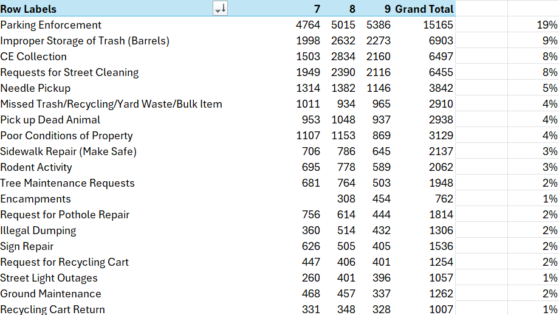

# Boston 311 Call Stream

An interactive web application for visualizing and exploring Boston's 311 service requests in real-time. Built with Next.js, TypeScript, and MapLibre GL, this application provides an intuitive interface to browse, search, and analyze citizen service requests across the city.



## ✨ Features

### 🗺️ Interactive Map
- **Live visualization** of 311 service requests on an interactive map
- **Clickable markers** that reveal detailed information about each request
- **Dynamic focusing** - zoom to specific locations with smooth animations
- **Visual indicators** - different colors for request types, larger markers for selected items
- **Hover tooltips** showing request titles for quick reference

### 📋 Smart Sidebar
- **Real-time data** showing the 100 most recent incidents
- **Clickable entries** that sync with the map view
- **Visual status indicators** with color-coded badges (Open, Closed, In Progress)
- **Photo indicators** showing which requests include submitted photos
- **Responsive highlighting** of selected items

### 🔍 Detailed Modal Views
- **Rich information display** with organized card layouts
- **Photo galleries** showing submitted and resolution photos from Cloudinary
- **Timeline visualization** with color-coded status indicators
- **Location details** including neighborhood, ZIP code, and coordinates
- **Department information** and request categorization
- **"View on Map" integration** for seamless navigation

### 📊 Data Processing
- **CSV-based data loading** from Boston's 311 dataset
- **Smart filtering** to show the most recent 100 incidents
- **Date-based sorting** with newest requests displayed first
- **Data validation** using Zod schemas for type safety
- **Error handling** for malformed data entries

## 🚀 Getting Started

### Prerequisites
- Node.js (version 18 or higher)
- pnpm (recommended) or npm

### Installation

1. **Clone the repository**
   ```bash
   git clone <repository-url>
   cd streetvibe
   ```

2. **Install dependencies**
   ```bash
   pnpm install
   # or
   npm install
   ```

3. **Start the development server**
   ```bash
   pnpm dev
   # or
   npm run dev
   ```

4. **Open your browser**
   Navigate to [http://localhost:3000](http://localhost:3000)

### Building for Production

```bash
pnpm build
pnpm start
```

## 🏗️ Architecture

### Tech Stack
- **Frontend Framework**: Next.js 15 with App Router
- **Language**: TypeScript for type safety
- **Styling**: Tailwind CSS for utility-first styling
- **State Management**: React Query (TanStack Query) for data fetching
- **Maps**: MapLibre GL with react-map-gl
- **Data Validation**: Zod for runtime type checking
- **Icons**: Lucide React for consistent iconography

### Project Structure
```
src/
├── app/                    # Next.js app router pages
│   ├── globals.css        # Global styles and CSS variables
│   ├── layout.tsx         # Root layout component
│   └── page.tsx           # Main application page
├── components/             # React components
│   ├── Map.tsx            # Interactive map component
│   ├── MapMarker.tsx      # Custom map marker component
│   ├── ServiceRequestModal.tsx  # Detailed view modal
│   └── Sidebar.tsx        # Request list sidebar
├── hooks/                 # Custom React hooks
│   └── use-311-data.ts    # Data fetching and processing
├── types/                 # TypeScript type definitions
│   └── boston-311.ts      # 311 data schemas
└── lib/                   # Utility functions
    └── utils.ts           # Helper functions
```

## 📈 Data Insights

The application uses real Boston 311 data, providing insights into:

- **Request Types**: Parking violations, code enforcement, street maintenance, etc.
- **Geographic Distribution**: Visualization of where requests are concentrated
- **Timeline Patterns**: When requests are opened and resolved
- **Department Workload**: Which city departments handle different types of requests
- **Resolution Tracking**: Visual indicators of request status and completion

### Data Sources
- **Primary Dataset**: Boston's official 311 service request data
- **Photos**: Cloudinary-hosted images submitted by citizens and city workers
- **Geographic Data**: Coordinate-based mapping with neighborhood information

## 🎨 Design Principles

### User Experience
- **Immediate Visual Feedback**: Clicking any item immediately shows its location
- **Contextual Information**: Hover states and tooltips provide quick insights
- **Responsive Design**: Works seamlessly on desktop and mobile devices
- **Progressive Enhancement**: Graceful degradation when images fail to load

### Visual Design
- **Clean Interface**: Minimal design focusing on data clarity
- **Color Coding**: Consistent color scheme for status and request types
- **Typography**: Clear hierarchy with readable fonts
- **Spacing**: Generous whitespace for easy scanning

## 🔧 Configuration

### Environment Variables
The application supports the following optional environment variables:

```env
# For custom map styles (if needed)
NEXT_PUBLIC_MAPBOX_ACCESS_TOKEN=your_token_here
```

### Image Domains
The application is configured to load images from:
- `spot-boston-res.cloudinary.com` (Boston's official image storage)

## 📱 Usage

### Exploring Requests
1. **Browse the sidebar** to see recent 311 requests
2. **Click any item** to see detailed information
3. **Use the map** to explore geographic distribution
4. **Click markers** on the map for quick access to details

### Understanding the Data
- **Open requests** are shown in red
- **Closed requests** are shown in green
- **Photo indicator (📷)** shows requests with images
- **Larger markers** indicate currently selected items

### Navigation
- **"View on Map" button** zooms to the exact location
- **Modal close** returns to the main view
- **Sidebar selection** syncs with map highlighting

## 🤝 Contributing

We welcome contributions! Please consider:

1. **Bug Reports**: Use GitHub issues to report problems
2. **Feature Requests**: Suggest new functionality or improvements
3. **Code Contributions**: Fork the repo and submit pull requests
4. **Documentation**: Help improve this README or add code comments

### Development Guidelines
- Follow the existing TypeScript patterns
- Use Tailwind CSS for styling
- Ensure accessibility compliance
- Add error boundaries for robust error handling

## 📄 License

This project is open source and available under the MIT License.

## 📋 Development Roadmap

See our [TODO.md](./TODO.md) for the complete implementation plan, including:
- Migration to Elasticsearch for real-time data streaming
- Multi-city support (Boston + Cambridge + future expansion)
- Kubernetes deployment architecture
- Performance optimization goals

## 🙏 Acknowledgments

- **City of Boston** for providing open 311 data
- **MapLibre** for the excellent mapping library
- **Cloudinary** for hosting citizen-submitted photos
- **Next.js team** for the robust React framework

---

Built with ❤️ for civic transparency and community engagement.